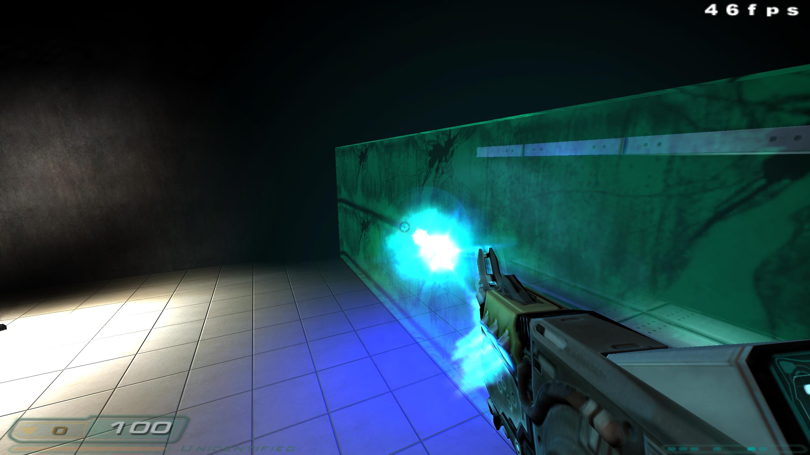
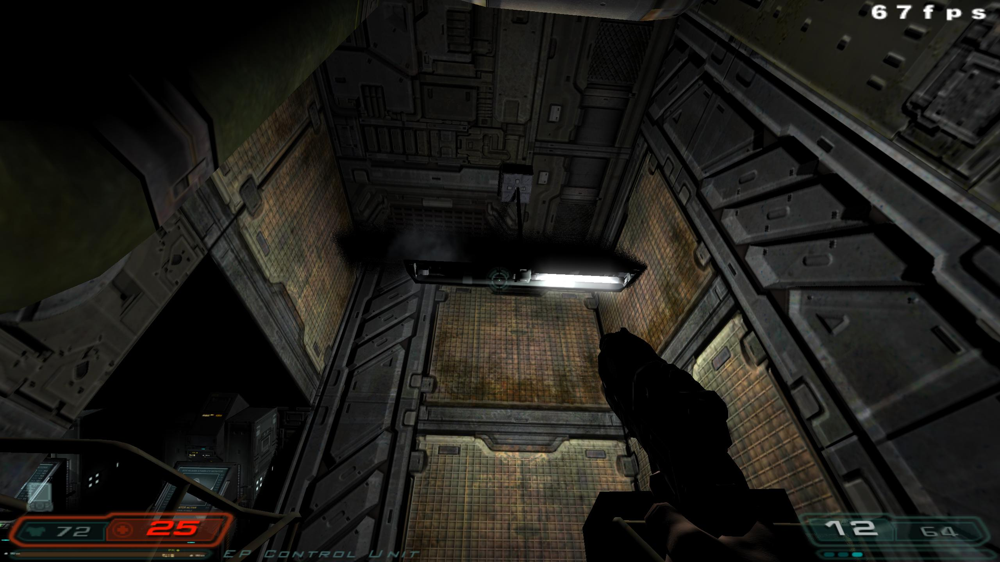
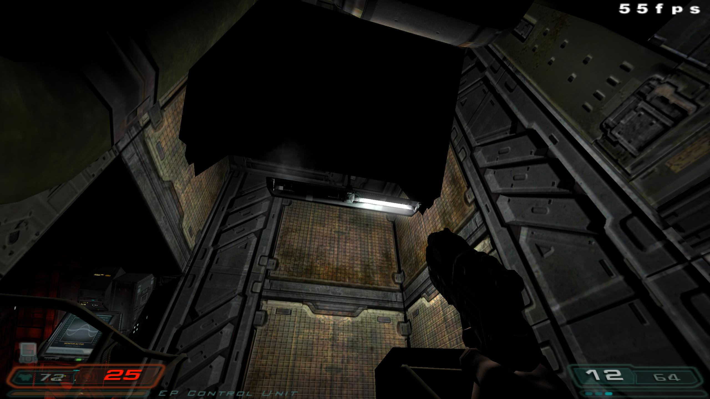
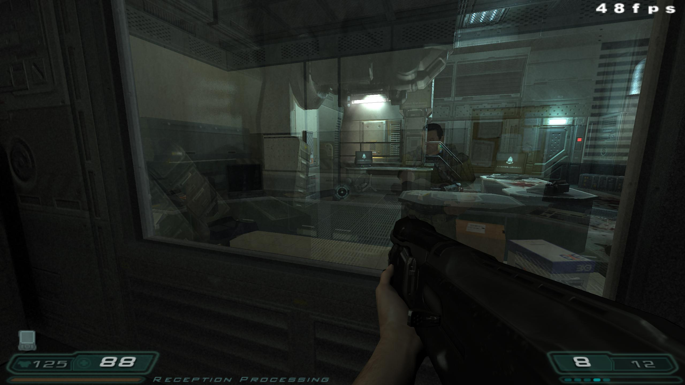

# ABOUT DHEWM3-RT

$\color{red}{\textbf{
This project is not affiliated with Dhewm3.}}$

$\color{red}{\textbf{Do not bother that team with bug reports or feature requests.}}  $

**They have made an understandable stance against AI.  Respect their choices.** 

This project would be impossible without their foundation and updates to the original source code.

This project is an attempt to implement Raytracing in Vulkan on top of Dhewm3 as an experiment in AI development on a complex code-base.  Vulkan allows cross-platform ray-tracing to work on any manufacturer's graphics cards.

_Dhewm 3 RT_ is an updated version of _dhewm 3_ which is based on the _Doom 3_ GPL source port.  This version has been tested on Windows.   I forked Dhewm3 from the official repository at https://github.com/dhewm/dhewm3 in March 2026.  

### Original Dhewm3 and vkDoom3 Source Links
Original Dhewm3 Links:

**The Dhewm3 homepage is:** https://dhewm3.org

**The Dhewm3 project is hosted at:** https://github.com/dhewm

I have also been using the _vkDoom3_ Vulkan implementation as a reference, which I found after starting work on this.  (https://github.com/DustinHLand/vkDOOM3)

## Process

I have been using Claude Code (Sonnet 4.5) and GitHub Copilot (GPT 5-3 Codex) to develop code.  I mostly review their output, generate plans, and test it quickly.  Given the well-established language and frameworks, famous code base, reference implementations, and quick build cycle this is about as well positioned for success as you can find. 
I would be cautious about assuming any AI coding projects work this well in the real world when most of those conditions are not true or failure modes take longer to appear. 

# RayTracing Changes

- Vulkan rendering pipeline.  This kept the original GL pipeline that can be toggled back to, and created a Vulkan pipeline in parallel.
- Raytraced shadows and acceleration structures.
- Ray-Traced Ambient Occlusion with temporal filtering 
- Ray traced reflections
- One bounce global illumination
- Tweaked lighting on projectiles for some weapons (pulse rifle, rocket launcher)

## Useful Cvars

The pipeline and ray-tracing can be enabled/disabled at the terminal in game or via CLI flags.  These are accessible from the Dhewm3 Settings Menu (F10) under RayTracing.  

| Flag | Values | Action  |
|------|--------|-----------|
| r_backend         | openGL, vulkan | Switch backend.  Needs restart.|
| r_rtuseraytracing | 0, 1 | Toggle for all ray-tracing vs rasterization.  |
| r_rtshadows       | 0, 1 | Toggle Ray-Traced Shadows  |
| r_rtao            | 0, 1 | Toggle Ambient Occlusion |
| r_rtreflections   | 0, 1 | Toggle Ray-Traced Reflections |
| r_rtgi            | 0, 1 | Toggle Ray-Traced Global Illumination |

- Of all of these, the reflections seem like the biggest upgrade (and there are ways of doing those in the old engine).  Glass is 
plentiful enough early on.  Working to increase scope of reflections to particles/lighting while maintaining performance.
- Currently global illumination is pretty rough, and seems to mostly be a flat increase to the lighting which kills the original vibe.  Currently tuning.

## Screenshots

This is just a definition change to add the color, since this was already in-game but probably off for performance reasons.

Ray Traced Shadows are in.  This shows some distinctions with how we're selecting lights - potentially some errors in math and light selection?  Here the side light above the player casts the main shadow in RT, while the stencil has a much moodier shadow.

Ray Traced reflections are going.  With `g_showplayershadow` toggled on, the third person player model is visible and can be reflected.  Animations not perfectly in sync between third person and first person.   Working on including muzzle flash and particles in here.  Animated entities are visible behind you!

## Additional Files

Part of the build process requires compiling the Vulkan shaders and copying them. 
Currently the compiled shaders are compiled and copied in `base/glprogs/glsl` relative to where the player's save data and config lives.
(e.g. ~/Documents/dhewm3/)

I am also exploring editing some gun definitions to cast more light.  
Those should be copied to `base/def` alongside the shaders to take effect in game.
Updated Plasma Rifle particles to shed blue light on pulses.
Updated Rockets to show light.

# GENERAL NOTES

Follow the Dhewm3 Notes on patching.  As with Dhewm3, you must have the original game data, purchased from your store of choice.  

## Game data and patching

This source release does not contain any game data, the game data is still
covered by the original EULA and must be obeyed as usual.

You must patch the game to the latest version (1.3.1). See the FAQ for details, including
how to get the game data from Steam on Linux or OSX.

Note that the original _Doom 3_ and _Doom 3: Resurrection of Evil_ (together with
_DOOM 3: BFG Edition_, which is *not* supported by dhewm3-rt) are available from the Steam Store at

https://store.steampowered.com/app/208200/DOOM_3/

https://www.gog.com/en/game/doom_3

See https://dhewm3.org/#how-to-install for game data installation instructions.  The same libraries and setup apply with this version.

## Configuration

See [Configuration.md](./Configuration.md) for dhewm3-specific configuration, especially for 
using gamepads or the new settings menu.

## Compiling

The build system is based on CMake: http://cmake.org/

Required libraries are not part of the tree. These are:

- OpenAL (OpenAL Soft required)
- SDL v1.2 or 2.0 (2.0 recommended)
- libcurl (optional, required for server downloads)
- Optionally, on non-Windows: libbacktrace (usually linked statically)
  - sometimes (e.g. on debian-based distros like Ubuntu) it's part of libgcc (=> always available),
    sometimes (e.g. Arch Linux, openSUSE) it's in a separate package
  - If this is available, dhewm3 prints more useful backtraces if it crashes
- Vulkan 1.4 (install the SDK)

## Back End Rendering of Stencil Shadows

The Doom 3 GPL source code release **did** not include functionality enabling rendering
of stencil shadows via the "depth fail" method, a functionality commonly known as
"Carmack's Reverse".  
It was been restored in dhewm3 1.5.1 after Creative Labs' [patent](https://patents.google.com/patent/US6384822B1/en)
finally expired.

## MayaImport

The original Dhewm3 code for the Maya export plugin is still included, if you are a Maya licensee
you can obtain the SDK from Autodesk.

# LICENSES

See COPYING.txt for the GNU GENERAL PUBLIC LICENSE

ADDITIONAL TERMS:  The Doom 3 GPL Source Code is also subject to certain additional terms. You should have received a copy of these additional terms immediately following the terms and conditions of the GNU GPL which accompanied the Doom 3 Source Code.  If not, please request a copy in writing from id Software at id Software LLC, c/o ZeniMax Media Inc., Suite 120, Rockville, Maryland 20850 USA.

EXCLUDED CODE:  The code described below and contained in the Doom 3 GPL Source Code release is not part of the Program covered by the GPL and is expressly excluded from its terms.  You are solely responsible for obtaining from the copyright holder a license for such code and complying with the applicable license terms.

## Dear ImGui

neo/libs/imgui/*

The MIT License (MIT)

Copyright (c) 2014-2024 Omar Cornut

Permission is hereby granted, free of charge, to any person obtaining a copy
of this software and associated documentation files (the "Software"), to deal
in the Software without restriction, including without limitation the rights
to use, copy, modify, merge, publish, distribute, sublicense, and/or sell
copies of the Software, and to permit persons to whom the Software is
furnished to do so, subject to the following conditions:

The above copyright notice and this permission notice shall be included in all
copies or substantial portions of the Software.

THE SOFTWARE IS PROVIDED "AS IS", WITHOUT WARRANTY OF ANY KIND, EXPRESS OR
IMPLIED, INCLUDING BUT NOT LIMITED TO THE WARRANTIES OF MERCHANTABILITY,
FITNESS FOR A PARTICULAR PURPOSE AND NONINFRINGEMENT. IN NO EVENT SHALL THE
AUTHORS OR COPYRIGHT HOLDERS BE LIABLE FOR ANY CLAIM, DAMAGES OR OTHER
LIABILITY, WHETHER IN AN ACTION OF CONTRACT, TORT OR OTHERWISE, ARISING FROM,
OUT OF OR IN CONNECTION WITH THE SOFTWARE OR THE USE OR OTHER DEALINGS IN THE
SOFTWARE.

## PropTree

neo/tools/common/PropTree/*

Copyright (C) 1998-2001 Scott Ramsay

sramsay@gonavi.com

http://www.gonavi.com

This material is provided "as is", with absolutely no warranty expressed
or implied. Any use is at your own risk.

Permission to use or copy this software for any purpose is hereby granted
without fee, provided the above notices are retained on all copies.
Permission to modify the code and to distribute modified code is granted,
provided the above notices are retained, and a notice that the code was
modified is included with the above copyright notice.

If you use this code, drop me an email.  I'd like to know if you find the code
useful.

## Base64 implementation

neo/idlib/Base64.cpp

Copyright (c) 1996 Lars Wirzenius.  All rights reserved.

June 14 2003: TTimo <ttimo@idsoftware.com>

modified + endian bug fixes

http://bugs.debian.org/cgi-bin/bugreport.cgi?bug=197039

Redistribution and use in source and binary forms, with or without
modification, are permitted provided that the following conditions
are met:

1. Redistributions of source code must retain the above copyright
   notice, this list of conditions and the following disclaimer.

2. Redistributions in binary form must reproduce the above copyright
   notice, this list of conditions and the following disclaimer in the
   documentation and/or other materials provided with the distribution.

THIS SOFTWARE IS PROVIDED BY THE AUTHOR ``AS IS'' AND ANY EXPRESS OR
IMPLIED WARRANTIES, INCLUDING, BUT NOT LIMITED TO, THE IMPLIED
WARRANTIES OF MERCHANTABILITY AND FITNESS FOR A PARTICULAR PURPOSE ARE
DISCLAIMED.  IN NO EVENT SHALL THE AUTHOR BE LIABLE FOR ANY DIRECT,
INDIRECT, INCIDENTAL, SPECIAL, EXEMPLARY, OR CONSEQUENTIAL DAMAGES
(INCLUDING, BUT NOT LIMITED TO, PROCUREMENT OF SUBSTITUTE GOODS OR
SERVICES; LOSS OF USE, DATA, OR PROFITS; OR BUSINESS INTERRUPTION)
HOWEVER CAUSED AND ON ANY THEORY OF LIABILITY, WHETHER IN CONTRACT,
STRICT LIABILITY, OR TORT (INCLUDING NEGLIGENCE OR OTHERWISE) ARISING IN
ANY WAY OUT OF THE USE OF THIS SOFTWARE, EVEN IF ADVISED OF THE
POSSIBILITY OF SUCH DAMAGE.

## miniz

src/framework/miniz/*

The MIT License (MIT)

Copyright 2013-2014 RAD Game Tools and Valve Software
Copyright 2010-2014 Rich Geldreich and Tenacious Software LLC

All Rights Reserved.

Permission is hereby granted, free of charge, to any person obtaining a copy
of this software and associated documentation files (the "Software"), to deal
in the Software without restriction, including without limitation the rights
to use, copy, modify, merge, publish, distribute, sublicense, and/or sell
copies of the Software, and to permit persons to whom the Software is
furnished to do so, subject to the following conditions:

The above copyright notice and this permission notice shall be included in
all copies or substantial portions of the Software.

THE SOFTWARE IS PROVIDED "AS IS", WITHOUT WARRANTY OF ANY KIND, EXPRESS OR
IMPLIED, INCLUDING BUT NOT LIMITED TO THE WARRANTIES OF MERCHANTABILITY,
FITNESS FOR A PARTICULAR PURPOSE AND NONINFRINGEMENT. IN NO EVENT SHALL THE
AUTHORS OR COPYRIGHT HOLDERS BE LIABLE FOR ANY CLAIM, DAMAGES OR OTHER
LIABILITY, WHETHER IN AN ACTION OF CONTRACT, TORT OR OTHERWISE, ARISING FROM,
OUT OF OR IN CONNECTION WITH THE SOFTWARE OR THE USE OR OTHER DEALINGS IN
THE SOFTWARE.

## IO on .zip files using minizip

src/framework/minizip/*

Copyright (C) 1998-2010 Gilles Vollant (minizip) ( http://www.winimage.com/zLibDll/minizip.html )

Modifications of Unzip for Zip64
Copyright (C) 2007-2008 Even Rouault

Modifications for Zip64 support
Copyright (C) 2009-2010 Mathias Svensson ( http://result42.com )

This software is provided 'as-is', without any express or implied
warranty.  In no event will the authors be held liable for any damages
arising from the use of this software.

Permission is granted to anyone to use this software for any purpose,
including commercial applications, and to alter it and redistribute it
freely, subject to the following restrictions:

1. The origin of this software must not be misrepresented; you must not
   claim that you wrote the original software. If you use this software
   in a product, an acknowledgment in the product documentation would be
   appreciated but is not required.
2. Altered source versions must be plainly marked as such, and must not be
   misrepresented as being the original software.
3. This notice may not be removed or altered from any source distribution.

## MD4 Message-Digest Algorithm

neo/idlib/hashing/MD4.cpp

Copyright (C) 1991-2, RSA Data Security, Inc. Created 1991. All
rights reserved.

License to copy and use this software is granted provided that it
is identified as the "RSA Data Security, Inc. MD4 Message-Digest
Algorithm" in all material mentioning or referencing this software
or this function.

License is also granted to make and use derivative works provided
that such works are identified as "derived from the RSA Data
Security, Inc. MD4 Message-Digest Algorithm" in all material
mentioning or referencing the derived work.

RSA Data Security, Inc. makes no representations concerning either
the merchantability of this software or the suitability of this
software for any particular purpose. It is provided "as is"
without express or implied warranty of any kind.

These notices must be retained in any copies of any part of this
documentation and/or software.

## MD5 Message-Digest Algorithm

neo/idlib/hashing/MD5.cpp

This code implements the MD5 message-digest algorithm.
The algorithm is due to Ron Rivest.  This code was
written by Colin Plumb in 1993, no copyright is claimed.
This code is in the public domain; do with it what you wish.

## CRC32 Checksum

neo/idlib/hashing/CRC32.cpp

Copyright (C) 1995-1998 Mark Adler

## stb_image and stb_vorbis

neo/renderer/stb_image.h
neo/sound/stb_vorbis.h

Used to decode JPEG and OGG Vorbis files.

from https://github.com/nothings/stb/

Copyright (c) 2017 Sean Barrett

Released under MIT License and Unlicense (Public Domain)

## Brandelf utility

neo/sys/linux/setup/brandelf.c

Copyright (c) 1996 Søren Schmidt
All rights reserved.

Redistribution and use in source and binary forms, with or without
modification, are permitted provided that the following conditions
are met:
1. Redistributions of source code must retain the above copyright
   notice, this list of conditions and the following disclaimer
   in this position and unchanged.
2. Redistributions in binary form must reproduce the above copyright
   notice, this list of conditions and the following disclaimer in the
   documentation and/or other materials provided with the distribution.
3. The name of the author may not be used to endorse or promote products
   derived from this software withough specific prior written permission

THIS SOFTWARE IS PROVIDED BY THE AUTHOR ``AS IS'' AND ANY EXPRESS OR
IMPLIED WARRANTIES, INCLUDING, BUT NOT LIMITED TO, THE IMPLIED WARRANTIES
OF MERCHANTABILITY AND FITNESS FOR A PARTICULAR PURPOSE ARE DISCLAIMED.
IN NO EVENT SHALL THE AUTHOR BE LIABLE FOR ANY DIRECT, INDIRECT,
INCIDENTAL, SPECIAL, EXEMPLARY, OR CONSEQUENTIAL DAMAGES (INCLUDING, BUT
NOT LIMITED TO, PROCUREMENT OF SUBSTITUTE GOODS OR SERVICES; LOSS OF USE,
DATA, OR PROFITS; OR BUSINESS INTERRUPTION) HOWEVER CAUSED AND ON ANY
THEORY OF LIABILITY, WHETHER IN CONTRACT, STRICT LIABILITY, OR TORT
(INCLUDING NEGLIGENCE OR OTHERWISE) ARISING IN ANY WAY OUT OF THE USE OF
THIS SOFTWARE, EVEN IF ADVISED OF THE POSSIBILITY OF SUCH DAMAGE.

`$FreeBSD: src/usr.bin/brandelf/brandelf.c,v 1.16 2000/07/02 03:34:08 imp Exp $`

## makeself - Make self-extractable archives on Unix

neo/sys/linux/setup/makeself/*, neo/sys/linux/setup/makeself/README
Copyright (c) Stéphane Peter
Licensing: GPL v2
