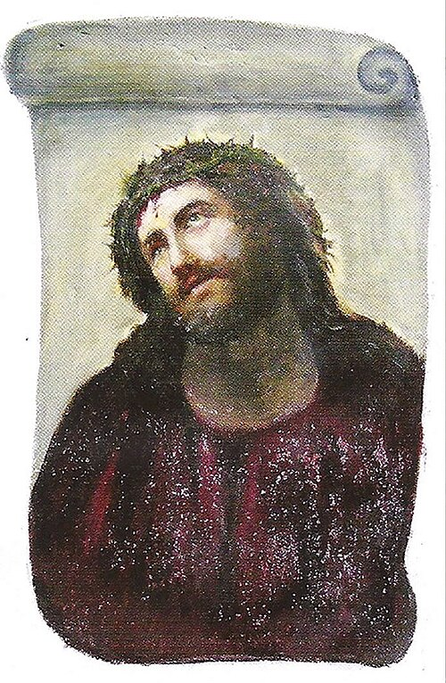
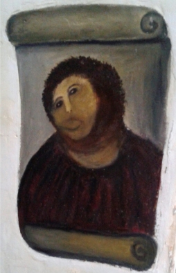
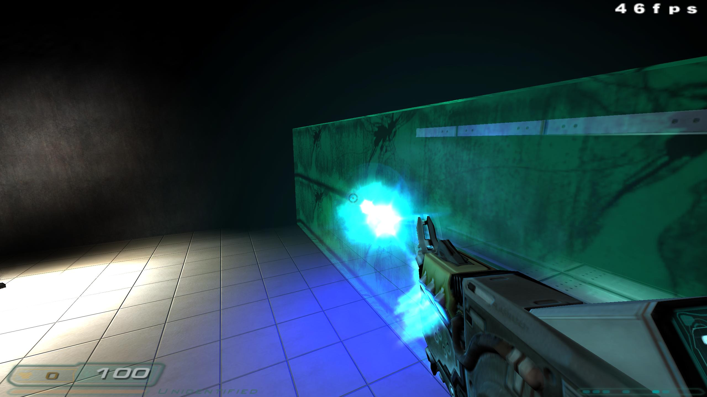
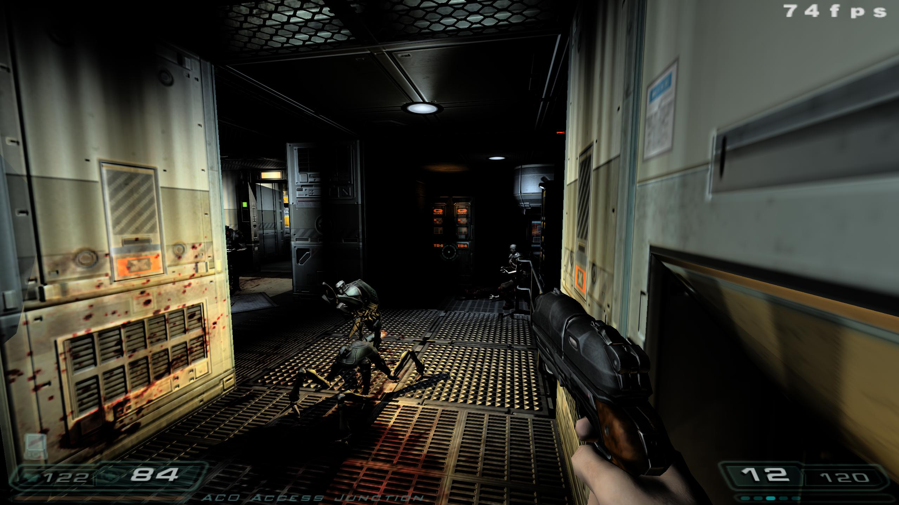
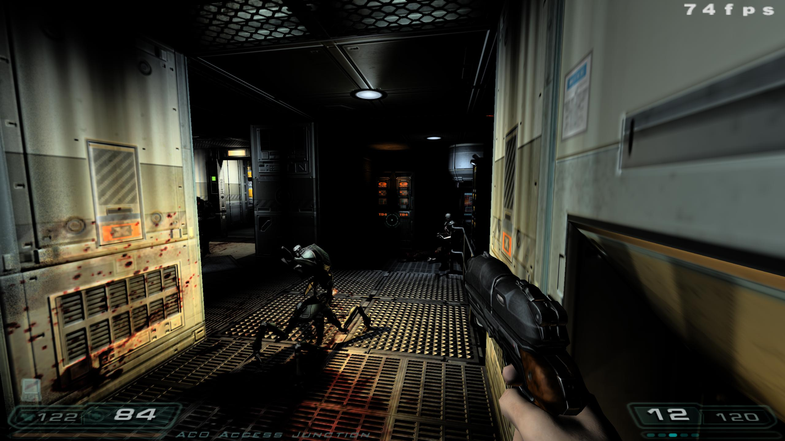
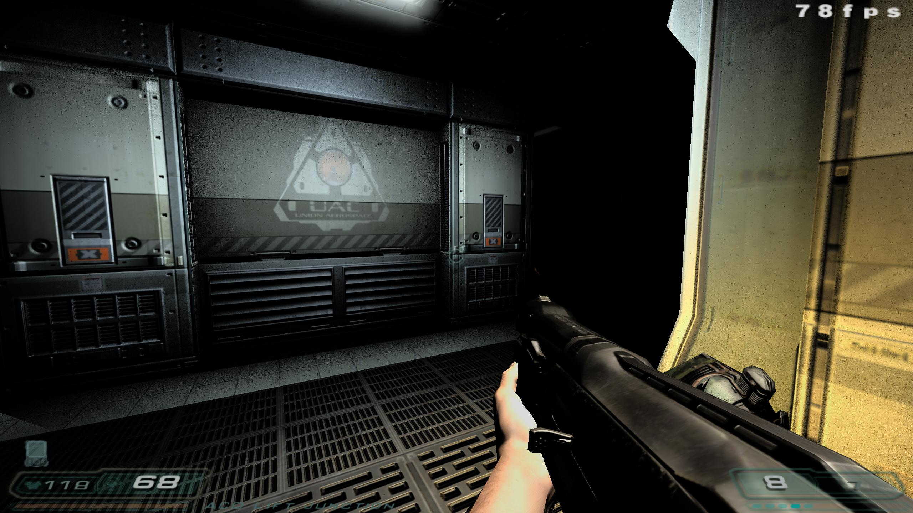
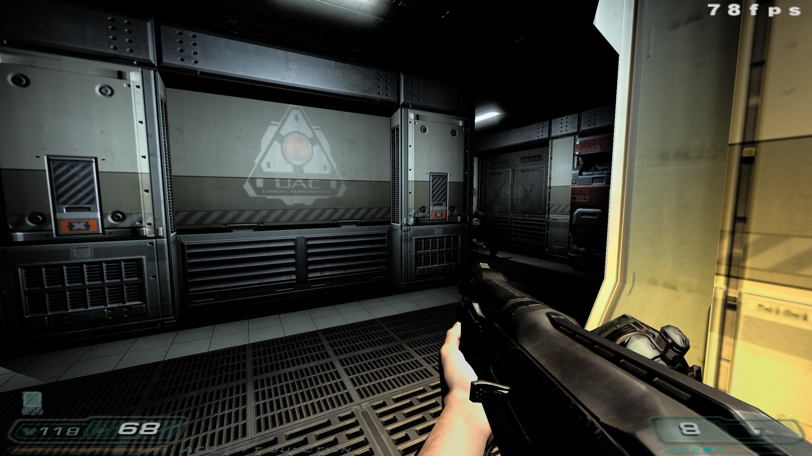
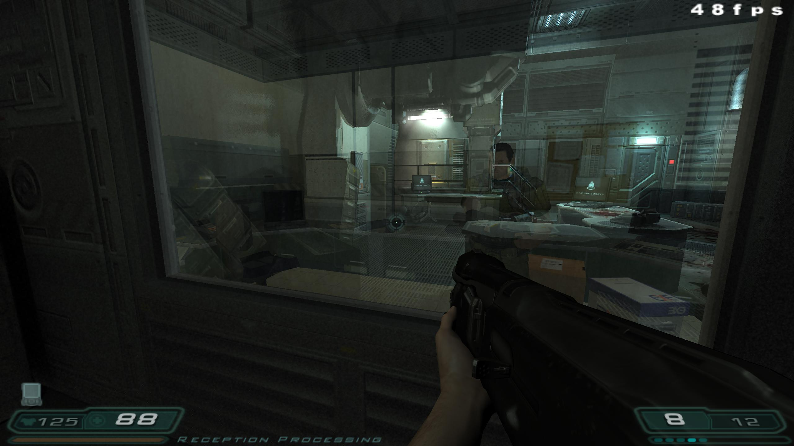
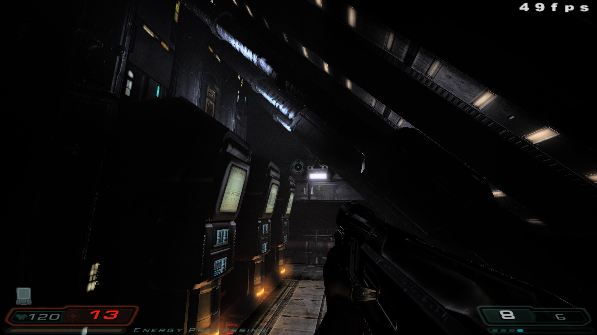
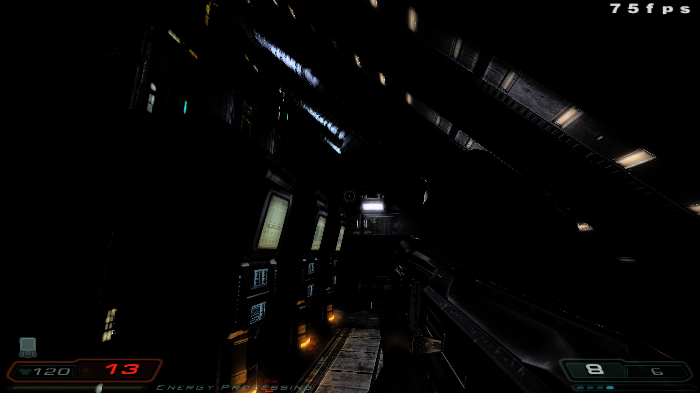

# ABOUT DHEWM3-RT

$\color{red}{\textbf{
This project is not affiliated with Dhewm3.}}$

$\color{red}{\textbf{Do not bother that team with bug reports or feature requests.}}  $

**They have made an understandable stance against AI.  Respect their choices.**  This project would be impossible without the Dhewm3 foundation and updates to the original source code.

|  Dhewm3 |  Dhewm3-RT | 
|:---------:|:-----------:|
|||
| Doom3/Dhewm3's source code | Vibe Coded Ray-Traced Additions|

This project is an attempt to implement Ray Tracing in Vulkan on top of Dhewm3 as an experiment in AI development on a complex code-base.  Vulkan allows cross-platform ray-tracing to work on any manufacturer's graphics cards.

_Dhewm 3 RT_ is an updated version of _dhewm 3_ which is based on the _Doom 3_ GPL source port.  I started off a clone of Dhewm3 from the official repository at https://github.com/dhewm/dhewm3 from a clone in May 2025 Commit hash: [0277f2](https://github.com/dhewm/dhewm3/commit/0277f298e85d8e2f0ca82a692c6dc0dc0d83c49b).  

### Original Dhewm3 and vkDoom3 Source Links
Original Dhewm3 Links:

**The Dhewm3 homepage is:** https://dhewm3.org

**The Dhewm3 project is hosted at:** https://github.com/dhewm

There is an archived _vkDoom3_ Vulkan implementation of Dhewm-BFG edition at  https://github.com/DustinHLand/vkDOOM3, which I found after starting work.

## Process and AI Thoughts

I have been using Claude Code (Sonnet 4.5) and GitHub Copilot (GPT 5-3 Codex) to develop code.  I mostly review their output, generate plans, and test it quickly.  This has mostly worked because:
- Doom3 is a famous C++ code base.  
- Well-established language (C++) and frameworks (Vulkan).
- It is a very clean starting point with well optimized code and no cruft.  
- More modern graphics techniques are well known at this point and incorporated into training corpus.
- There are good reference implementations to riff on
- Quick build cycle, so failure and testing is rapid with quick failure modes that appear in minutes, not months.  
- I have some experience as a software dev in other domains and can guide the LLM or correct it when hung up.
I would be cautious about assuming any AI coding projects work this well in the real world when most of those conditions are not true or failure modes take longer to appear. 

# Ray Tracing Changes

0. Tweaked lighting on projectiles for some weapons (pulse rifle, rocket launcher)

This is just a definition on the weapon to activate an existing effect.  This was already in-game but probably off for 2005 performance reasons.  Most noticeable on plasma and rockets.  

1. Vulkan rendering pipeline.  This kept the original GL pipeline that can be toggled back to, and created a Vulkan pipeline in parallel.  That is essential starting point for the vendor neutral ray-tracing work. 
2. Ray Traced shadows and acceleration structures.

Ray Traced Shadows are in.  (There was a bug around light origin that has been fixed).  Top screenshot is RT, lower screenshot is original stencil.  Slight differences in shadows, and we're blurring some.  In all, not that noticeable.  The third-person player model showing up is more impactful in shadows.  

3. Ray-Traced Ambient Occlusion with temporal filtering.   Now running properly and leads to darkening in the corners.

4. Ray traced Reflections

Ray Traced reflections are going.  With `g_showplayershadow` toggled on, the third person player model is visible and can be reflected.  Animations not perfectly in sync between third person and first person.   Working on including muzzle flash and particles in here.  Animated entities are visible behind you!  This could be fun for horror applications - though comes with a performance cost.  This is perhaps the biggest improvement, but could be possible without RT.

5. Global Illumination
One bounce global illumination.  Reflected surfaces can share luminance (e.g. light bouncing off a red wall illuminates a shadow).  This is potentially most helpful in other games (like Quake4) where the harsh lighting of Doom 3 clashes with the outdoor spaces (pitch black under bridges at midday)

5c. Tone mapping 
The global illumination passes were washing out the color and killing the mood.  We have added a Uchimara tone-map to try to restore that dynamic range while sticking close to the original art style even with all the addtional luminance.

6. Volumetric Lighting 
5b. Volumetric Lighting.  This gives light shafts more substance, with colored light filling the air.  Lends a lot of mood, especially for moving lights and shadows.  It does soften the harsh lighting of Doom 3, but gives light more volume, so a worthwhile tradeoff.

## Useful Cvars

The pipeline and ray-tracing can be enabled/disabled at the terminal in game or via CLI flags.  These are accessible from the Dhewm3 Settings Menu (F10) under Ray Tracing.  The defaults have been set to add noticeable effects - and where a better artist's eye is needed.  

## Overall Impact
Mostly, the ray-tracing is computationally expensive, and tends to fight the original art direction - which the map design and gameplay were already optimized towards.  
More physically based rendering tends to not be impressive given the game was built around the limitations of the engine.  
The various effects here tend to soften the harsh shadows of the original for a more diffuse brighter look.

The two effects I've tried that seem to actually add something are the reflections, and volumetric lighting.  Those both lean into what I liked about Doom 3: moody atmosphere and the play of light and shadow.  

- Of all of these, the reflections seem like the biggest upgrade (and there are ways of doing that without ray-tracing).  
Glass is plentiful enough early on.  Working to increase scope of reflections to particles/lighting while maintaining performance.
- Global illumination was less impressive than I hoped, but the volumetrics help a lot with mood.  I could see GI having the biggest improvement to a game like Quake 4 where Doom's harsh shadows look odd in exterior environments.

## Additional Files

- Part of the build process requires compiling the Vulkan shaders and copying them. 
Currently the compiled shaders are compiled and copied in `base/glprogs/glsl` relative to where the player's save data and config lives.
(e.g. ~/Documents/dhewm3/)

- I am also editing some gun definitions to cast more light.  
Those should be copied to `base/def` alongside the shaders to take effect in game.
Updated Plasma Rifle particles to shed blue light on pulses.
Updated Rockets to show light.

- There is also a material for tracking added GI accent lights in logging. 

# GENERAL NOTES

Follow the Dhewm3 Notes on patching.  As with Dhewm3, you must have the original game data, purchased from your store of choice.  

## Game data and patching

This source release does not contain any game data, the game data is still
covered by the original EULA and must be obeyed as usual.

You must patch the game to the latest version (1.3.1). 

Note that the original _Doom 3_ and _Doom 3: Resurrection of Evil_ (together with
_DOOM 3: BFG Edition_, which is *not* supported by dhewm3-rt) are available from the Steam Store at

https://store.steampowered.com/app/208200/DOOM_3/

https://www.gog.com/en/game/doom_3

See https://dhewm3.org/#how-to-install for game data installation instructions.  The same libraries and setup apply with this version.

## Configuration

See [Configuration.md](./Configuration.md) for dhewm3-specific configuration, especially for 
using gamepads or the new settings menu.

## Compiling

The build system is based on CMake: http://cmake.org/

Required libraries are not part of the tree. These are:

- OpenAL (OpenAL Soft required - need to have the env vars set up)
- SDL v1.2 or 2.0 (2.0 recommended)
- libcurl (optional, required for server downloads)
- Optionally, on non-Windows: libbacktrace (usually linked statically)
  - If this is available, dhewm3 prints more useful backtraces if it crashes
- Vulkan 1.4 (install the SDK)

## Back End Rendering of Stencil Shadows

The Doom 3 GPL source code release **did** not include functionality enabling rendering
of stencil shadows via the "depth fail" method, a functionality commonly known as
"Carmack's Reverse".  
It was been restored in dhewm3 1.5.1 after Creative Labs' [patent](https://patents.google.com/patent/US6384822B1/en)
finally expired.

## MayaImport

The original Dhewm3 code for the Maya export plugin is still included, if you are a Maya licensee
you can obtain the SDK from Autodesk.

# LICENSES

See COPYING.txt for the GNU GENERAL PUBLIC LICENSE

ADDITIONAL TERMS:  The Doom 3 GPL Source Code is also subject to certain additional terms. You should have received a copy of these additional terms immediately following the terms and conditions of the GNU GPL which accompanied the Doom 3 Source Code.  If not, please request a copy in writing from id Software at id Software LLC, c/o ZeniMax Media Inc., Suite 120, Rockville, Maryland 20850 USA.

See THIRD-PARTY-LICENSES.md for the bundled third-party components (Dear ImGui,
AMD FidelityFX Super Resolution 2, miniz, minizip, stb, and others) — that file
carries the EXCLUDED CODE notice and each component's licence in full.

